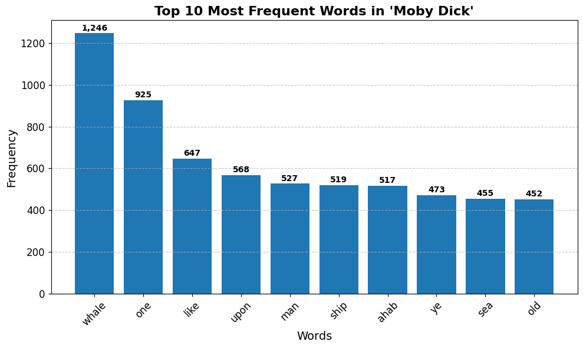

# Moby Dick Word Frequency Analysis

This project performs a simple **text analysis** on *Moby Dick* by Herman Melville.  
It fetches the book’s text from an online source, cleans and tokenizes it, removes common stopwords, and then identifies the **top 10 most frequent words**.

## 📌 Features
- Downloads *Moby Dick* in HTML format.
- Parses and extracts raw text using **BeautifulSoup**.
- Tokenizes text to keep only alphanumeric words with **NLTK RegexpTokenizer**.
- Removes English stopwords using **NLTK**.
- Counts and displays the top 10 most frequent words with **collections.Counter**.

## 🛠️ Technologies Used
- **Python 3**
- **Requests** – for fetching HTML content.
- **BeautifulSoup (bs4)** – for HTML parsing.
- **NLTK** – for tokenization and stopword removal.
- **collections.Counter** – for word frequency counting.

